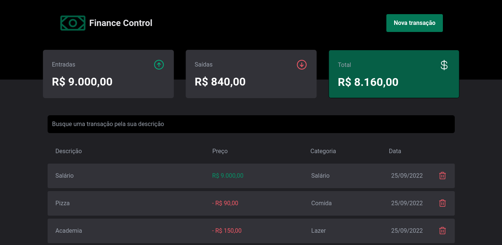

# Finance Control

  

# Contexto
Este projeto trata-se de uma aplicação financeira, onde faz o calculo de entradas e saidas de dinheiro.

Design - Rocketseat DT Money

## Técnologias usadas

Front-end:
> Desenvolvido usando: React, TypeCript, Radix, Tailwind CSS, uuid, vite


## Para testa-lo localmente

> Clone o repositorio
```
  git clone git@github.com:Vitosoaresp/finance-control.git
```

#### Instale as dependencias

```bash
  cd finance-control/
  npm install
``` 
#### Para iniciar a aplicação

```
  npm start
```
